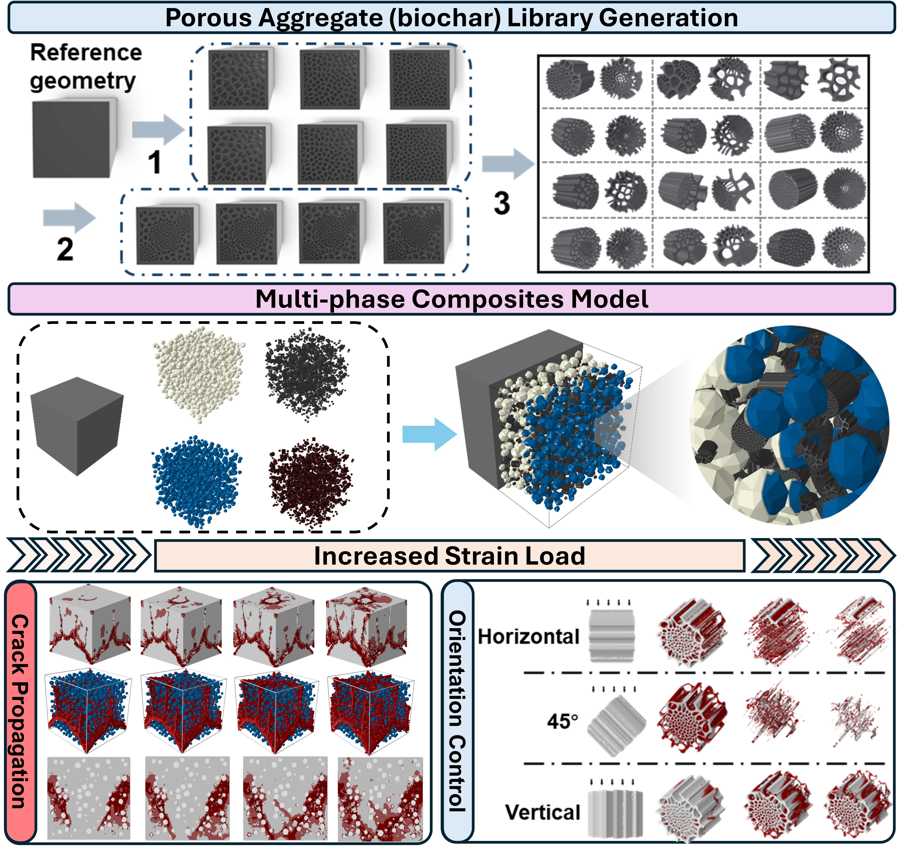

<h1 align="center">A Multi-Phase Mechanical Model of Biochar–Cement Composites at the Mesoscale</h1>

<h3 align="center">
  Muduo Li1, Xiaohong Zhu2, Yuying Zhang1,3, Daniel C. W. Tsang1
</h3>

<h4 align="center">
  1Department of Civil and Environmental Engineering, The Hong Kong University of Science and Technology, Hong Kong, China 
  2Department of Civil and Environmental Engineering, University of California, Berkeley, Berkeley, California, USA 
  3Laboratory for Waste Management, Nuclear Energy and Safety, Paul Scherrer Institute, Villigen, Switzerland
</h4>

  

  

## Introduction
We introduce a framework to create a multi-phase model of biochar-cement composites. The geometry is built in Grasshopper, and the code is based on Python. It contains three files: 
- **Three-Phase Model**: This includes cement, aggregate, and the interfacial transition zone (ITZ).
- **Five-Phase Model**: This expands to include cement, aggregate, ITZ, biochar, and the biochar-cement ITZ.
- **Biochar Library Geometric Files**: These files contain the geometric configurations for the biochar.

## Citation
If this code is useful for your research, please cite our publication:

Li, M., Zhu, X., Zhang, Y., & Tsang, D. C. W. (2024). A multi-phase mechanical model of biochar–cement composites at the mesoscale. *Computer-Aided Civil and Infrastructure Engineering, 1–21*. [https://doi.org/10.1111/mice.13307](https://doi.org/10.1111/mice.13307)
